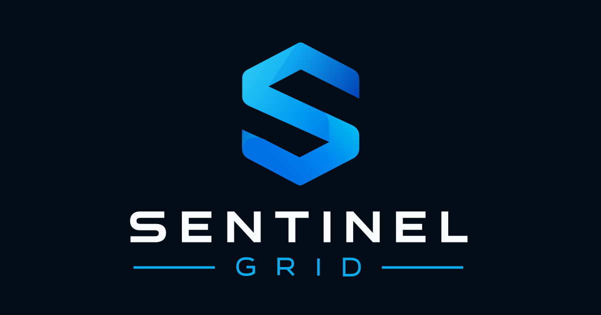

<div align="center">


SentinelGrid

Monitor infrastructure. Manage endpoints. Respond remotely.

A modern RMM + monitoring platform for IT teams, MSPs and organizations.

<br />


<br />



<br />

Overview ·
Features ·
Architecture ·
Security ·
Agent ·
Roadmap

</div>

⚡ Overview

SentinelGrid is a multi-tenant infrastructure monitoring and remote-management platform built to bring the day-to-day work of IT operations into a single interface.

Instead of jumping between monitoring dashboards, remote tools, inventory systems and audit logs, SentinelGrid brings them together:

          MONITOR
             │
             ▼
   ┌───────────────────┐
   │   SentinelGrid    │
   └───────────────────┘
      ▲             ▲
      │             │
   MANAGE        RESPOND

It combines:

infrastructure monitoring

Windows endpoint inventory

health and performance telemetry

remote device actions

PowerShell / CMD terminal access

native outbound RDP

incidents and alerts

audit trails

organization and member management

subscription-aware access control

signed Agent lifecycle and updates

The goal: know what is happening, understand what changed, and act safely from one place.

✨ What SentinelGrid does

<table>
<tr>
<td width="50%" valign="top">

🖥️ Endpoint visibility

See the state of managed Windows devices at a glance.

hardware & OS inventory

online / offline state

CPU, RAM and disk usage

Agent version

manufacturer / model / serial

activity history

performance history

</td>
<td width="50%" valign="top">

⚡ Remote actions

Execute operational tasks without opening a full remote session.

Force Inventory

Flush DNS

GPUpdate

Restart Agent

Update Agent

Lock

Restart

Shutdown

</td>
</tr>

<tr>
<td width="50%" valign="top">

💻 Remote access

Operate endpoints securely from the platform.

PowerShell terminal

CMD terminal

authenticated WebSocket transport

native outbound RDP

short-lived session credentials

session limits and expiry

</td>
<td width="50%" valign="top">

📡 Monitoring

Track services and infrastructure health.

HTTP / HTTPS monitors

availability

response time

monitoring history

alerts

incidents

notifications

</td>
</tr>

<tr>
<td width="50%" valign="top">

🏢 Multi-tenant management

Organize infrastructure the way MSPs and IT teams actually work.

Organization
└── Client
    ├── Site
    └── Device

</td>
<td width="50%" valign="top">

🔐 Security-first access

Access is calculated from:

Role
+
Organization subscription
+
Plan entitlement
+
Subscription state

</td>
</tr>
</table>

🧭 Product map

SentinelGrid
│
├── Dashboard
│
├── Monitors
│
├── Organizations
│   ├── Members
│   ├── Invitations
│   ├── Clients
│   └── Settings
│
├── Devices
│   ├── Overview
│   ├── Activity
│   ├── Performance
│   ├── Actions
│   ├── Terminal
│   └── RDP
│
├── Incidents
├── Alerts
├── Billing
└── Settings

🏗️ Architecture

flowchart TB
    Browser["Browser / Dashboard"]
    Web["Next.js App<br/>Vercel"]
    DB["Supabase<br/>Auth + PostgreSQL + RLS"]
    Redis["Upstash Redis"]
    Realtime["Realtime Relay<br/>Railway"]
    RDPRelay["RDP Relay"]
    Agent["SentinelGridAgent<br/>Windows / Go"]
    Updater["SentinelGridUpdater"]
    RDP["SentinelGridRDP"]

    Browser --> Web
    Web --> DB
    Web --> Redis

    Browser <--> Realtime
    Agent <--> Realtime
    Realtime <--> Redis
    Realtime <--> DB

    Browser <--> RDPRelay
    RDP <--> RDPRelay

    Agent --> Web
    Agent --> Updater
    Agent --> RDP

Infrastructure split

Layer

Service

Purpose

Web

Vercel

Next.js, dashboard, HTTP APIs

Data

Supabase

Auth, PostgreSQL, RLS

Realtime

Railway

Persistent WebSocket workloads

Coordination

Upstash Redis

Pub/Sub, tickets, locks, telemetry

Endpoint

Windows Agent

Inventory, heartbeat, commands, remote access

Persistent realtime connections are intentionally hosted outside Vercel. The Next.js application keeps short-lived HTTP workloads while Railway handles long-running WebSocket connections.

🔐 Security & access

SentinelGrid uses organization-aware authorization throughout the platform.

flowchart LR
    U["User"] --> M["Membership"]
    M --> R["Role"]
    M --> O["Selected Organization"]
    O --> S["Organization Subscription"]
    S --> P["Plan Entitlements"]
    S --> ST["Subscription State"]
    R --> A["Effective Access"]
    P --> A
    ST --> A

Roles

Role

Access

Owner

Full organization, billing, members, infrastructure and remote capabilities

Admin

Operational management and remote capabilities

Member

Read-only infrastructure access

Important rule

Each organization has its own subscription; user accounts have no billing plan.

Roles and plan entitlements are independent. An admin can operate infrastructure but cannot change billing. A member is read-only.

Central access layer

lib/organization-access.ts
lib/organization-access-core.ts
lib/plans.ts

Remote capabilities use explicit permissions:

devices.actions
devices.terminal
devices.rdp

💎 Plans

Plan

Members

Clients

Devices

Monitors

Free

1

3

10

10

Pro

5

25

100

100

Business

20

500

500

500

Enterprise

Custom

Custom

Custom

Custom

Remote actions, Terminal, RDP, audit logs and alerts have no plan paywalls in this release. Roles still apply. Pricing, names, marketing descriptions and official capacities are defined in `lib/plans.ts`; public Pricing and Billing both consume that configuration. Enterprise licenses are explicit finite values, never implicitly unlimited.

Subscription lifecycle

Stripe confirms subscription state through signed webhooks. Active/trialing subscriptions and payment retries (`past_due`) retain their paid capacity. Ended, unpaid, paused or incomplete subscriptions use Free capacity without deleting infrastructure or disabling existing agents. Cancellation defaults to the end of the billing period.

No destructive downgrade

If a Pro customer with 100 devices moves to Free:

100 devices remain
heartbeats continue
monitoring continues
new devices are blocked

SentinelGrid does not delete infrastructure because of a billing change.

🖥️ Windows Agent

<div align="center">

Current repository version: 0.1.12

</div>

The Agent is written in Go and runs as a Windows service:

SentinelGridAgent

It handles:

enrollment

heartbeat

inventory

CPU / RAM / disk telemetry

realtime connectivity

typed device commands

terminal execution

update checks

update handoff

command recovery

Inventory collected

Hostname          OS
OS Version        OS Build
Architecture      Local IP
MAC Address       Manufacturer
Model             Serial Number
CPU               RAM
Agent Version

⚡ Device Actions

<div align="center">

Maintenance

Agent

Power

Force Inventory

Restart Agent

Lock

Flush DNS

Update Agent

Restart

GPUpdate


Shutdown

</div>

Device Actions are protected server-side with:

organization membership
+
devices.actions
+
plan entitlement
+
subscription state
+
remote-access policy
+
device availability
+
rate limiting
+
idempotency

They are delivered through the realtime command pipeline and recorded in Device Activity.

💻 Remote Terminal

SentinelGrid supports both:

PowerShell
CMD

sequenceDiagram
    participant Browser
    participant API as Next.js API
    participant Relay as Realtime Relay
    participant Agent as Windows Agent

    Browser->>API: Create terminal session
    API-->>Browser: Authorized session
    Browser->>Relay: JWT-authenticated WebSocket
    Relay->>Agent: Terminal command
    Agent-->>Relay: stdout / stderr / exit code
    Relay-->>Browser: Result

Authorization is enforced twice:

HTTP session creation
+
Realtime WebSocket handshake

Both paths require:

devices.terminal
+
terminal entitlement
+
organization entitlement state

🖥️ Native RDP

RDP uses an outbound architecture so managed endpoints do not need a publicly exposed inbound RDP port.

flowchart LR
    Client["Remote Client"] --> API["SentinelGrid API"]
    API --> Client
    Client <--> Relay["RDP Relay"]
    Endpoint["SentinelGridRDP"] <--> Relay
    Endpoint <--> Windows["Windows RDP"]

The current RDP design includes:

authenticated session creation

remote-access organization policy

device online checks

capability checks

short-lived one-use tickets

hashed ticket storage

session expiry

idle timeout

browser-origin validation

relay authentication

rate limiting

session limits

revocation

auditability

<details>
<summary><strong>Core RDP files</strong></summary>

lib/remote/rdp.ts
lib/remote/rdp-policy.ts
app/api/devices/[deviceId]/rdp
relay/

</details>

📈 Performance

Device Performance uses real Agent heartbeat metrics.

Available periods:

1 hour
24 hours
7 days
30 days

GET /api/devices/:deviceId/performance?range=1h|24h|7d|30d

Rolling telemetry is stored in Redis.

Important behavior:

heartbeat does not fail if telemetry storage fails

old values are not fabricated

Redis is not treated as a durable audit store

wider time ranges use lower sampling density

reads are authorized before telemetry access

🚨 Incidents & Alerts

Incidents

Current incidents expose operational evidence such as:

failed commands

expired commands

audit failures

Agent update evidence

Alerts

Current signals include:

device offline state

heartbeat state

monitor failures

missing monitor checks

SentinelGrid does not yet pretend to be a full ITSM/ticketing platform. Assignment, acknowledgement, escalation and advanced notification rules are later roadmap items.

🧾 Activity & Audit

Device Activity combines:

Audit events
+
Device commands
+
Update evidence

Records are correlated when reliable IDs exist.

SentinelGrid deliberately avoids inventing:

versions

durations

success states

incident timestamps

Audit data remains separate from rolling telemetry.

🔄 Agent Updates

The full-product MSI contains:

SentinelGridAgent.exe
SentinelGridUpdater.exe
SentinelGridRDP.exe

The secure update flow includes:

Eligibility
    ↓
Download
    ↓
SHA256
    ↓
Authenticode
    ↓
Signer Pin
    ↓
MSI Validation
    ↓
Staging
    ↓
Windows Installer
    ↓
Restart
    ↓
Authenticated Heartbeat
    ↓
Success

Current update protocol:

Protocol 2

Detailed lifecycle documentation lives in:

installer/windows/UPDATES.md

Production auto-update still requires complete isolated Windows lifecycle qualification before broad rollout.

🌐 Realtime

The realtime layer carries:

Agent presence

Device Actions

command results

Terminal

RDP availability notifications

Browser / Agent
      │
      ▼
Railway Realtime Relay
      │
      ├── Redis
      └── Supabase

Commands:

npm run build:realtime
npm run start:realtime
npm run test:realtime

🎨 Dashboard

SentinelGrid uses a shared dark operational design system.

Current appearance presets:

Sentinel
Midnight
Aurora
Graphite

Interface preferences include:

Comfortable / Compact density

System / Full / Reduced motion

Expanded / Compact / Remember sidebar

List / Grid default client view

🧱 Stack

<div align="center">

Web

Data

Realtime

Endpoint

Next.js

Supabase

Node.js

Go

React 19

PostgreSQL

WebSocket

Windows Services

TypeScript

RLS

Upstash Redis

WiX MSI

Tailwind

Supabase Auth

Railway

Authenticode

</div>

✅ Project Status

Area

Status

Authentication

✅

Organizations

✅

Members & Invitations

✅

Clients / Sites / Devices

✅

Windows Agent

✅

Inventory / Heartbeat

✅

Device Performance

✅

Device Activity

✅

Device Actions

✅

Device Actions plan enforcement

✅

Terminal

✅

Terminal plan enforcement

✅

Realtime Relay

✅

RDP Architecture

✅

RDP entitlement enforcement

🟡

Incidents

✅

Alerts

✅

Audit Logging

✅

Billing foundation

✅

Stripe Checkout, subscription changes and signed webhook synchronization

⏳

Production-qualified RDP

🟡

Production-qualified auto-update

🟡

DNS / Domains

⏳

🚀 Local Development

Requirements

Node.js 22+
npm
Go
Supabase
Upstash Redis
WiX Toolset

Setup

git clone https://github.com/aleksssc/sentinelgrid.git
cd sentinelgrid

npm install

Copy-Item .env.example .env.local

npm run dev

Open:

http://localhost:3000

⚙️ Environment

Use .env.example as the canonical reference.

<details>
<summary><strong>Supabase</strong></summary>

NEXT_PUBLIC_SUPABASE_URL=
NEXT_PUBLIC_SUPABASE_PUBLISHABLE_KEY=
SUPABASE_SECRET_KEY=
SUPABASE_SERVICE_ROLE_KEY=

</details>

<details>
<summary><strong>Redis</strong></summary>

UPSTASH_REDIS_KV_REST_API_URL=
UPSTASH_REDIS_KV_REST_API_TOKEN=

</details>

<details>
<summary><strong>Realtime</strong></summary>

SENTINELGRID_REALTIME_URL=
SENTINELGRID_REALTIME_BROWSER_ORIGIN=
SENTINELGRID_REALTIME_BIND=
SENTINELGRID_REALTIME_PORT=

</details>

<details>
<summary><strong>RDP</strong></summary>

SENTINELGRID_RELAY_URL=
SENTINELGRID_RDP_RELAY_SECRET=
SENTINELGRID_RDP_BACKEND_URL=

</details>

<details>
<summary><strong>Agent updates & signing</strong></summary>

SENTINELGRID_AGENT_UPDATES_ENABLED=
SENTINELGRID_SIGN_CERT_THUMBPRINT=
SENTINELGRID_UPDATE_SIGNER_SHA256=
SENTINELGRID_SIGN_TIMESTAMP_URL=

</details>

Never commit production secrets, service-role credentials or private signing material.

🧪 Testing

# Web
npm run build
npm run lint
npx tsc --noEmit

# Performance
npm run test:performance

# Realtime
npm run test:realtime

# Agent
cd agent
go test ./...
go vet ./...

Additional focused test suites exist under scripts/ for Device Actions, Terminal, RDP, Activity, updates, appearance and dashboard behavior.

🗂️ Repository

sentinelgrid/
│
├── agent/                  Windows Agent
├── app/                    Next.js App Router
├── components/             UI components
├── installer/              MSI / update docs
├── lib/
│   ├── audit/
│   ├── realtime/
│   ├── remote/
│   ├── supabase/
│   ├── organization-access-core.ts
│   ├── organization-access.ts
│   └── plans.ts
├── relay/                  Realtime & RDP relay
├── scripts/                Tests / build tooling
├── public/                 Brand assets
├── .env.example
└── README.md

🗺️ Roadmap

<table>
<tr>
<td width="50%" valign="top">

✅ Core platform

Authentication

Organizations

Clients / Sites / Devices

Windows Agent

Heartbeat & Inventory

Performance

Device Activity

Device Actions

Terminal

Realtime relay

RDP architecture

Incidents & Alerts

</td>
<td width="50%" valign="top">

🚧 SaaS & remote access

Central access layer

Device Actions entitlement

Terminal entitlement

RDP entitlement

Resource limit enforcement

Enrollment limit enforcement

Production billing rollout and Stripe webhook delivery qualification

</td>
</tr>

<tr>
<td width="50%" valign="top">

🔒 Security expansion

SSL monitoring

DNS monitoring

Domain management

Port discovery

Exposed services

Vulnerability correlation

Risk scoring

</td>
<td width="50%" valign="top">

🚀 Platform

Reports

API access

Webhooks

Integrations

Advanced RBAC

Enterprise customization

</td>
</tr>
</table>

🧠 Principles

<div align="center">

Server-side authorization · Tenant isolation · Least privilege
Short-lived credentials · Signed updates · No destructive downgrade
No fake telemetry · No frontend-only security

</div>

🎯 Vision

<div align="center">

One place to answer:

What do we manage?
What is online?
What changed?
What failed?
What needs attention?
What can we safely do remotely?

<br />


SentinelGrid

Visibility. Control. Security.

</div>

## Organization billing deployment

The application now reads only `organization_subscriptions`. Do not deploy the new application against the old schema. The legacy `account_subscriptions` table/function remain intact for reconciliation, not new subscriptions. Existing RDP, updater and Agent transports are unchanged; the shared entitlement code also ships in the realtime relay, which must be rebuilt/redeployed with the application.

### Database rollout (SQL editor or your existing migration runner)

Take a database backup and use a maintenance window for the final cutover. Apply these migrations in order:

1. `supabase/migrations/202609170001_billing_expand.sql`: additive columns, organization billing backfill, unambiguous monitor assignment. It is safe to review data before cutover. Monitor candidates include both organization ownership and memberships; users with multiple candidates are not assigned automatically.
2. Review `select id,user_id from public.monitors where organization_id is null;`. Assign unresolved rows explicitly only after verifying their correct tenant. Reconcile legacy paid subscriptions/customer IDs that could not be assigned to exactly one owned organization. Set every Enterprise `licensed_*` value explicitly. Never clone one Stripe subscription into multiple organizations.
3. `202609170002_billing_cutover.sql`: validation, NOT NULL/FKs, official plan seed, transactional quota triggers, tenant integrity, RLS/grants and token-based invite RPCs. It deliberately aborts on ambiguous monitors, unresolved legacy billing or missing Enterprise licenses. Fix the data and retry the transaction rather than disabling validations. Existing duplicate indexes are left alone because their exact names/dependencies were not supplied.
4. `202609170003_stripe_events.sql`: service-only billing leases, atomic webhook receipts/state/audit/notification writes and user notification read access.
5. Deploy this application and rebuild the existing realtime relay. Confirm a new organization is Free with one member, then qualify the real Checkout-to-webhook path in a separate test organization. Re-send a current subscription event for migrated Stripe subscriptions to reconcile authoritative periods/prices/status.

These migrations were prepared from the supplied snapshot. No hosted schema is changed by running `npm run build` or the local PostgreSQL tests. Applying migrations requires database-management access; the ordinary Supabase REST service key cannot execute schema DDL. Do not run the cutover while the old application is still creating user-scoped monitors.

To inspect the legacy trigger function (including non-public schemas), use:

```sql
select n.nspname, c.relname, t.tgname
from pg_trigger t join pg_proc p on p.oid=t.tgfoid
join pg_class c on c.oid=t.tgrelid join pg_namespace n on n.oid=c.relnamespace
where p.proname='create_default_account_subscription' and not t.tgisinternal;
```

### Stripe and environment

Copy the variable names in `.env.example` into the deployment environment. Server-only: `STRIPE_SECRET_KEY`, `STRIPE_WEBHOOK_SECRET`, `SUPABASE_SERVICE_ROLE_KEY` (or the existing `SUPABASE_SECRET_KEY`). Public: `NEXT_PUBLIC_SITE_URL`, `NEXT_PUBLIC_STRIPE_PUBLISHABLE_KEY` (reserved for future embedded payment UI; hosted Checkout needs no browser SDK). Set the Pro/Business Product and Price IDs through their four `STRIPE_*_PRODUCT_ID` / `STRIPE_*_PRICE_ID` variables. Never mix test and live mode IDs/keys. Production Checkout validates that the configured Stripe price matches the public EUR/month catalog; changing a price requires a new Stripe Price and updating its ENV ID.

Register `https://sentinelgrid-one.vercel.app/api/stripe/webhook` for:

- `checkout.session.completed`, `checkout.session.expired` (release abandoned Checkout reservations)
- `customer.subscription.created`, `customer.subscription.updated`, `customer.subscription.deleted`
- `invoice.paid`, `invoice.payment_failed`
- `subscription_schedule.updated`, `subscription_schedule.canceled`, `subscription_schedule.released` (keep pending downgrades synchronized, including changes outside this app)

Use the endpoint's signing secret in `STRIPE_WEBHOOK_SECRET`. Enable your required payment methods and configure retries/dunning in Stripe. The application creates/reuses a payment-method/invoice-only Customer Portal configuration; public Portal plan changes and cancellation are deliberately disabled so quotas and change timing stay explicit in the application. Confirm your Stripe account/business settings and the sales mailbox in `SALES_URL` before publishing Enterprise Contact Sales.

Owner-only POST routes: `/api/billing/checkout`, `change`, `cancel`, `resume`, `portal`. Inputs are `organizationId` and, for Checkout/change, `plan: pro | business`; arbitrary price IDs and extra fields are rejected. Checkout success never grants licenses. Paid upgrades invoice prorations immediately with `pending_if_incomplete`; failed upgrade payments do not grant extra capacity. Business-to-Pro uses a Subscription Schedule at period end, then releases the schedule after one Pro period. A pending downgrade can be removed by choosing Keep current plan. Cancellation releases a pending schedule and retains paid capacity until Stripe confirms termination.

Only signed webhooks activate/deactivate paid plans. A per-organization lease serializes Stripe reads/writes; an atomic SQL function deduplicates event IDs and commits billing state, audit logs and notifications together. Handlers fetch current Stripe state rather than trusting delivery order. A failed sync returns 503 so Stripe retries. Busy or expired leases do not silently grant entitlements. Customer IDs remain after cancellation; infrastructure is never deleted. Enterprise changes remain a trusted backend licensing operation, with no public Checkout.

Quotas run inside PostgreSQL for clients, devices, monitors, members and pending invitations, including service-role inserts and enrollment. Devices are counted through clients, monitor checks through monitors, and owner membership is deduplicated. A downgrade keeps data readable and existing heartbeats running; it only blocks additions above capacity. Tenant reassignment through arbitrary updates is rejected. Site/device/client relationships are validated independently of role checks. Invite acceptance consumes its reservation atomically and validates token, current user's email, expiry and membership quota. RDP SECURITY DEFINER RPCs retain their operational bodies but are executable only by service_role, matching their audited server callers.

### Qualification commands

- `node --test scripts/test-billing-core.mjs scripts/test-billing-database.mjs scripts/test-resource-creation.mjs`: real in-process PostgreSQL migrations/RLS/quota boundaries/atomic receipts plus pricing and role checks. No hosted database writes.
- `node scripts/check-billing-stripe.mjs`: read-only verification of configured Stripe Product/Price metadata.
- Windows CMD: `set SENTINELGRID_RUN_STRIPE_TESTS=1&& node scripts/test-billing-stripe-live.mjs`: explicitly test-mode-only real Stripe Checkout sessions, production upgrade/schedule helpers, cancel/resume, period-end cancellation and payment failure/recovery using an isolated test clock. Deletes only the created test resources afterwards; does not alter hosted application data. This does not substitute for browser payment completion and real webhook delivery into the migrated Supabase project.
- After `npm run build`, `node scripts/test-billing-http.mjs`: starts an isolated Next.js server on port 3047, verifies unsigned/tampered/signed webhook handling and request authorization, then stops that server.
- `npm run lint` and `npm run build`. The existing repository has no default `test` or `typecheck` script; `npx tsc --noEmit` is available.

Remaining rollout qualification: authenticated owner/admin/member browser scenarios against the migrated database, real Checkout completion and signed webhook delivery, simultaneous separate database connections contending at quota boundaries, and production Stripe settings. The SQL snapshot omitted complete grants and some constraints; inspect any production drift before rollout. No Agent/RDP index cleanup or MFA is part of billing.
